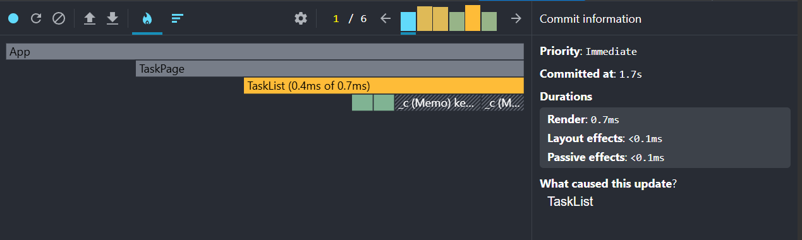

Lesson 2 

Анализ производительности через DevTools 

Скриншот после оптимизации. Компонент TaskCard был обёрнут в memo + стабилизированы передаваемые пропсы (removeTask), следовально, при каждом изменении отображаемых данных блоки не перерисовываются. При фильтрации и удалении ререндерится компонент TaskList, поэтому он жёлтого цвета (большое количество времени рендеринга в отличие от остальных компонент).
